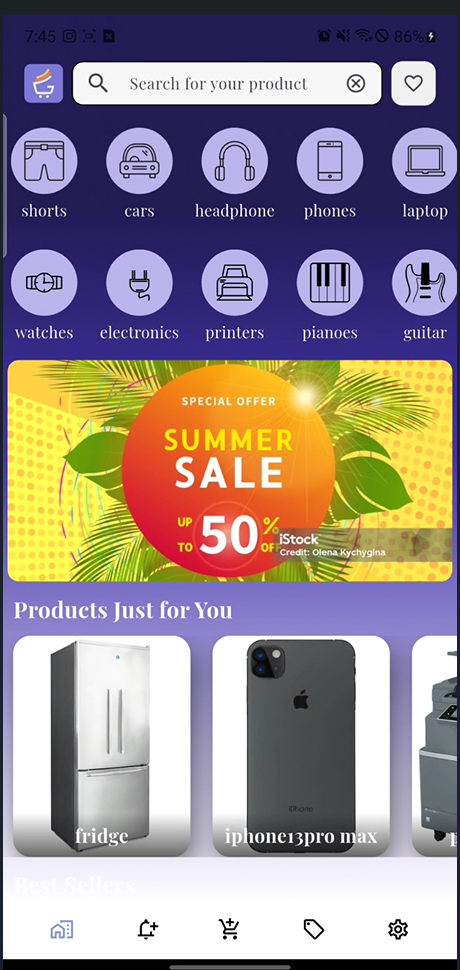
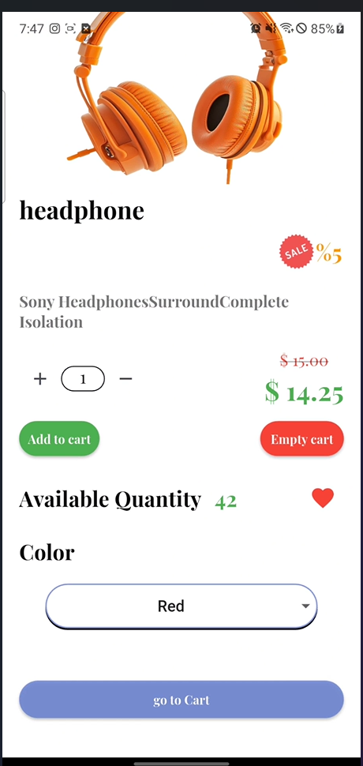
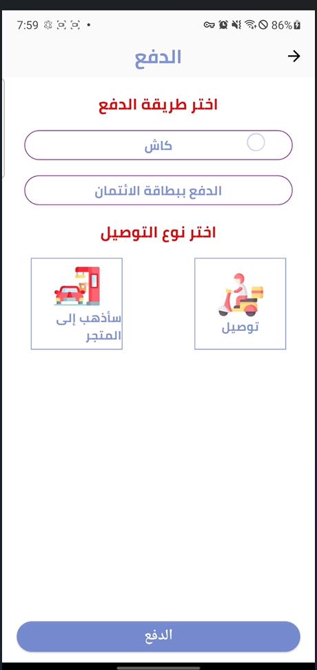
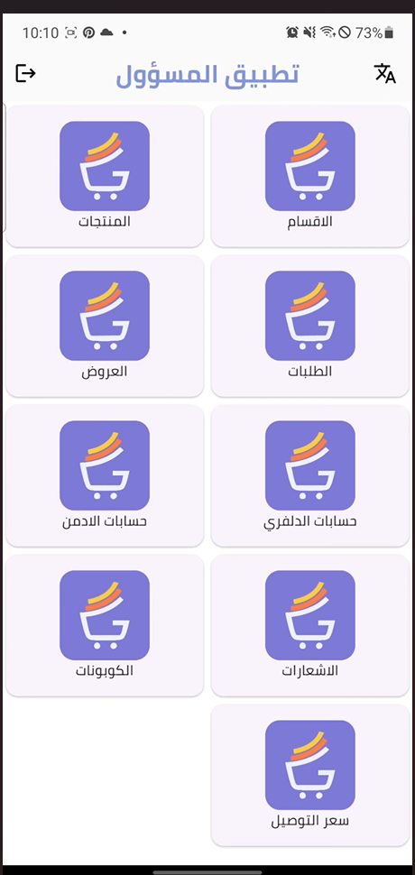
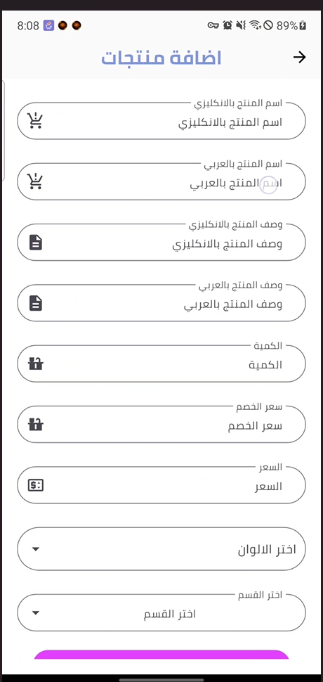
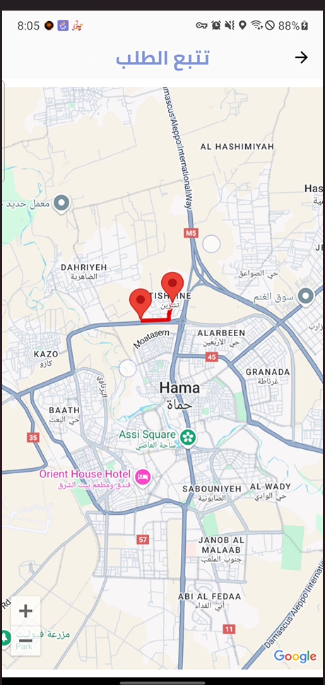

# Flutter E-Commerce System

<p align="center">
  
</p>

<h3 align="center">Complete Multi-Application E-Commerce System</h3>

<p align="center">
  Flutter • PHP • MySQL
</p>

---

## Overview

This project is a complete e-commerce system built with Flutter, PHP, and MySQL.

The system consists of three Flutter applications connected to a shared PHP/MySQL backend:

- **Customer App**
- **Admin App**
- **Delivery App**

Each application provides a different role within the complete e-commerce workflow, from product browsing and ordering to administration and delivery management.

---

## System Architecture

```text
                    ┌──────────────────────┐
                    │     Customer App     │
                    │        Flutter       │
                    └──────────┬───────────┘
                               │
                               │
                    ┌──────────▼───────────┐
                    │     PHP Backend      │
                    │     REST APIs        │
                    │       MySQL          │
                    └──────────▲───────────┘
                               │
                    ┌──────────┴───────────┐
                    │                      │
          ┌─────────┴─────────┐  ┌────────┴──────────┐
          │     Admin App     │  │   Delivery App   │
          │      Flutter      │  │      Flutter      │
          └───────────────────┘  └───────────────────┘
```

---

# Applications

## Customer App

The customer application provides the complete shopping experience.

### Features

- User registration and authentication
- Email verification
- Password recovery
- Product categories
- Product browsing
- Product details
- Product search
- Favorites
- Shopping cart
- Coupons and discounts
- Address management
- Checkout
- Order placement
- Order history
- Order details
- Delivery tracking
- Push notifications
- Google Maps integration
- Arabic and English localization

### Customer App Screens

<table>
<tr>
<td align="center"><strong>Home</strong></td>
<td align="center"><strong>Product Details</strong></td>
<td align="center"><strong>Checkout</strong></td>
</tr>
<tr>
<td></td>
<td></td>
<td></td>
</tr>
</table>

---

## Admin App

The administration application provides tools for managing the e-commerce platform.

### Features

- Admin authentication
- Dashboard
- Product management
- Category management
- Offers management
- Coupon management
- Delivery account management
- Delivery pricing management
- Order management
- Order details
- Order ratings
- Notifications
- Password recovery
- Arabic and English localization

### Admin App Screens

<table>
<tr>
<td align="center"><strong>Dashboard</strong></td>
<td align="center"><strong>Product Management</strong></td>
</tr>
<tr>
<td></td>
<td></td>
</tr>
</table>

---

## Delivery App

The delivery application is designed for managing delivery operations and tracking orders.

### Features

- Delivery authentication
- Assigned order management
- Pending orders
- Accepted orders
- Archived orders
- Order details
- Delivery tracking
- Google Maps integration
- Push notifications
- Password recovery
- Arabic and English localization

### Delivery App Screen

<p align="center">
  
</p>

---

# Technology Stack

## Flutter Applications

- Flutter
- Dart
- GetX
- HTTP
- Firebase Core
- Firebase Cloud Messaging
- Cloud Firestore
- Flutter Local Notifications
- Google Maps Flutter
- Geolocator
- Geocoding
- Flutter Polyline Points
- Sqflite
- Shared Preferences
- Lottie
- Cached Network Image
- Flutter SVG
- Google Sign-In
- Image Picker
- File Picker
- QR Flutter
- AudioPlayers

## Backend

- PHP
- MySQL
- PHPMailer
- REST-style API endpoints

---

# Project Structure

```text
flutter-ecommerce-system/
│
├── ecommerce/                  # Customer Flutter application
├── admin/                      # Admin Flutter application
├── delivary/                   # Delivery Flutter application
├── ecommercephp/               # PHP backend and API
├── screenshots/                # Project screenshots
├── .gitignore
└── README.md
```

---

# Backend Modules

The PHP backend contains API endpoints covering areas such as:

```text
auth/
address/
cart/
categories/
copon/
favorite/
forgetpassword/
items/
orders/
```

---

# Key Workflow

```text
Customer
   │
   ├── Browse Products
   ├── Search
   ├── Add to Favorites
   ├── Add to Cart
   ├── Apply Coupon
   ├── Manage Address
   └── Place Order
             │
             ▼
        PHP Backend
             │
             ▼
          MySQL
             │
             ▼
        Admin App
             │
             ├── Manage Order
             └── Assign Delivery
                        │
                        ▼
                 Delivery App
                        │
                        └── Deliver Order
```

---

# Getting Started

## 1. Clone the Repository

```bash
git clone https://github.com/yazannasr288/flutter-ecommerce-system.git
cd flutter-ecommerce-system
```

## 2. Backend Setup

Configure the PHP backend located in:

```text
ecommercephp/
```

Configure your own local:

- MySQL database
- Database username and password
- Backend/API configuration
- SMTP configuration if email functionality is required

## 3. Customer App

```bash
cd ecommerce
flutter pub get
flutter run
```

## 4. Admin App

```bash
cd admin
flutter pub get
flutter run
```

The Admin application contains a local package dependency defined in its `pubspec.yaml`, so that dependency must be available in the development environment.

## 5. Delivery App

```bash
cd delivary
flutter pub get
flutter run
```

---

# Configuration

Before running the applications, configure the required environment-specific values, including:

- API base URLs
- MySQL credentials
- Firebase configuration
- Google Maps configuration
- SMTP credentials

Production credentials and private API keys are not included in this public repository.

---

# Security

Sensitive production configuration has been intentionally excluded from this repository.

Examples include:

- Database passwords
- SMTP passwords
- Google Maps API keys
- Other private credentials

Use your own local configuration when running the project.

---

# Author

## Yazan Nasr

**Computer Engineer | Flutter & Full-Stack Developer**

GitHub: [@yazannasr288](https://github.com/yazannasr288)
